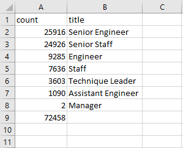
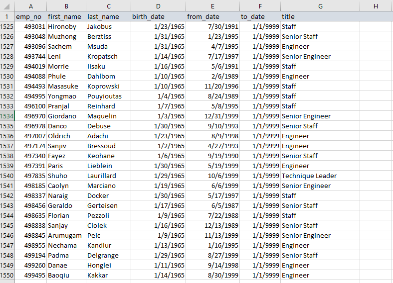

# Pewlett-Hackard-Analysis

## Overview of the Analysis
In this analysis we conducted an overview of the employment data for Pewlett-Hackard with a specific focus on a large surge of upcoming retirements. We constructed and implemented several new tables into the existing database. These tables have information pertinent to who may be retiring in the near future and who may be eligible to train some of the new work force that will need to brought on to fill the vacancies.

## Results

1. There is a very large bloc of employees who will likely be retiring in the very near future. Of the ~ 300,000 employees , more than 72,000 are at or near retirement age. 

2. There are likely to be some retirements at every staffing position of the company. However the 'Senior Staff' and 'Senior Engineer' positions are looking to be hit particularly hard with more than 2/3rd's of the likely retirees being in those postions.
3. Concerning the implementation of a mentorship program with some of the more senior staff who are not quite to retirement age there are 1549 employees who are eligible based on age. With the amount of training that will soon be required to replace almost 30% of the workforce it would porbably be advisable to implement everyone who is willing and eligible to this program.

4. Among those eligible for the mentorship program, even the least experienced have at least 19 years at the company.

## Summary

- Approximately 72,458 postions will need to be filled if Pewlett-Hackard wishes to maintain its current level of staffing.
- Depending on how many 'students' are desired per mentor it may be advisable to expand the mentorship program. With current projections each mentor would be mentoring around 50 new employees.

To these ends it would be advisable to elaborate on the query used to build the mentor program table to expand the birth date filter or replace it entirely with a filter based on hiring date to search for younger employees who also have substantial experience at the company.

Additionally, to help focus on where most of the replacements will be needed, a table that gave us a rough idea of the current breakdown of distribution of staff postions throughout the current roster. We know where most of our retirments will be, but not what proportion of their positions they make up.
